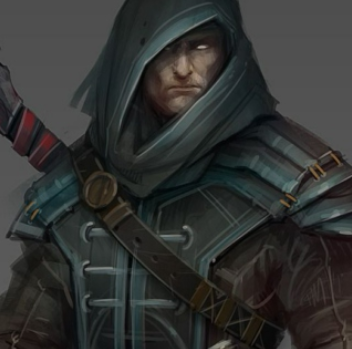

# Fallow Crow

## Backstory

&emsp;Silvan Crow was an assistant to a powerful, but introverted, wizard. He originally came to the Wizard as an apprentice, but soon it was obvious that despite being quite smart and very driven, Silvan had no magical talent.

&emsp;No Matter how hard he studied, no matter how much he learned and researched, he could not enact from the ether the power to cast even the simplest spell. In spite of this lack of ability, he found the wizard so endearing, good hearted, and loyalty inspiring, that he agreed to stay on as his assistant and to support the wizard in his endeavors for as long as he could.

&emsp;It was some years later when a group came through their small village in the middle of the night. They came shouting for the wizard, overpowered him with both magic and force, asking for information. Demanding in a strange language...something...but what it was Silvan could not understand. Instead of answering, the wizard with a regretful glance to Silvan, muttered a quiet spell and self immolated in torturous screaming agony until all that remained of the wizard collapsed into a pile of ashes.

&emsp;The group was so enraged at the loss of the wizard, their failure to get whatever information it was they wanted, that they took Silvan and buried him alive in the cold winter ground. In shock from the death of the wizard and from finding himself buried in a box...dying slowly of the cold and a lack of air....he swore in the darkness that surrounded him that if he was given the chance he would have his vengeance should anything listening care to grant him that desire.

&emsp;What Silvan didn’t know was that Larloch the Shadow King was watching, not out of randomness, but of all things because he owed a debt to the wizard from long ago. Despite being aligned so differently, the wizard had aided Larloch as a matter of honor when their fates had crossed. The Shadow King knew debt, though usually this worked the otherway around. He would repay his debt when and how he chose. The time had come.

&emsp;Larloch granted Silvan his boon...the power to use the abilities he had long trained for...but not those of a wizard...this was The Shadow King, afterall. No, these powers were darker, deeper, more appropriate to Silvan's wish and desire. He would grant him the power to pursue his vengeance for its own sake. *With only one string attached.* Larloch would kill two birds with one stone. Repay his distateful debt to the wizard and in doing so, increase the darkenss on this world. Even if the bearer of this mantle was not so dark himself...vengeance would see it used regardless. This pleased The Shadow King.

&emsp;From the day he crawled his way out of that cold frozen ground, he went by the name Fallow Crow. He never quite warmed up completely, never quite felt fully alive again, but it didn’t matter. Inside him burned an ice cold flame...vengeance would be his…one day…no matter how long it took. He would find them and send them all down to some place worse that they could imagine.

&emsp;And on this long road to finding these killers...should he come across any other circumstances of unsettled vengeance? Well, he could do that too. That was the one string attached...Fallow Crow's debt to the Shadow King...he would become vengeance personified where ever he found it needed.

## Note for the GM

(Sahaar: *I think that either Fallow Crow is either passing though the village shortly after the death of Lady Lucia and the need for vengeance on her part is a tie in for him, or possibly he had passed through before and become aquainted with her and felt a loyalty to her because of some experience they had had in the past[a previous quest. One aided the other? Possibly after metting out vengeance nearby he was wounded and she healed him. Or maybe she knew of someone who was guilty of very heinous things, but had gotten away with them, and they needed dealing with in a way that her Cleric beliefs didn't allow her to. So Fallow handled it for her in a particularly Fallow way.] I am flexible*)
